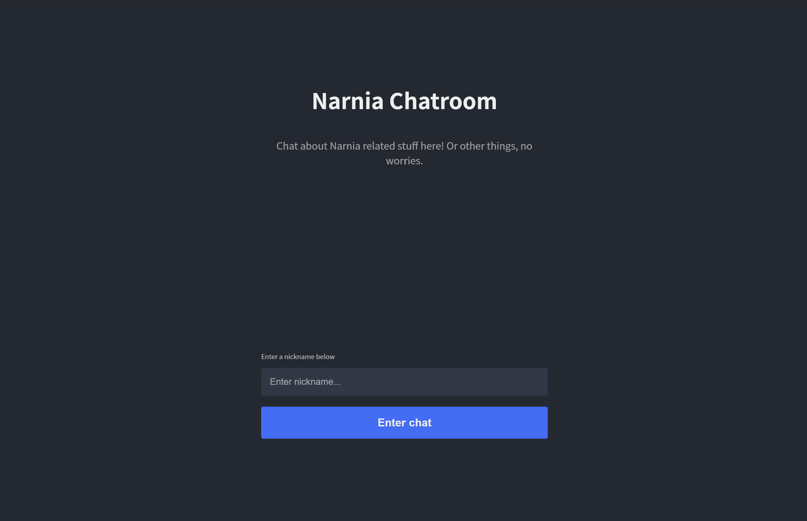
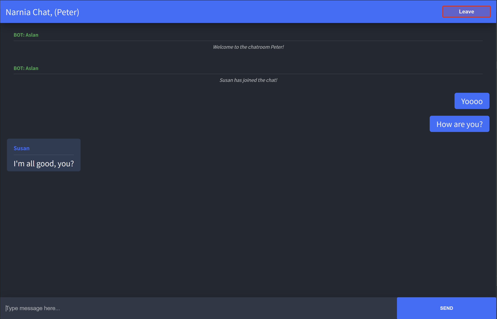
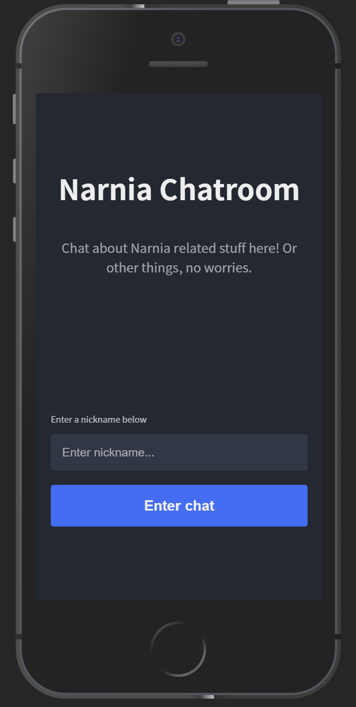
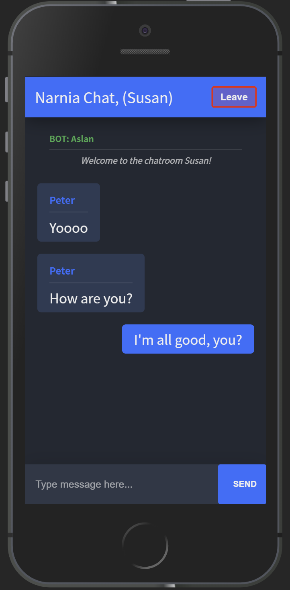

# Chat app Client with Socket.io, Typescript, React and Redux
 ## https://elastic-hoover-0b3086.netlify.app/

_____________________________________________________________________________
Dont forget to run "npm install" if you clone this repo! 

### Run the app
"npm run start"

### redux logger
If you want to use the redux-logger, just uncomment the import and the middleware in store.ts. 
It will show all stateChanges in the browser console. 

___________________________________________________________________

Will continue working on this project after the test.

Todos:
* Add loading spinner for Enter Chat button. 
* Refactor to make use of the socket event callbacks (should've read the docs more before the test); 
* Improve error handling and validation. 
* Light theme, to toggle
* Add avatars that users can pick. 
* Emoji support

